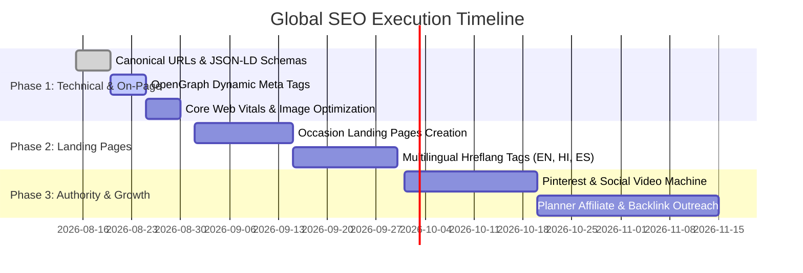

# Global SEO & Search Dominance Strategy: InviteLink.shop
**Target Market:** Worldwide (US, UK, Canada, Australia, India, UAE/GCC, Global NRI & Diaspora)  
**Primary Niche:** Interactive Digital Invitation Cards, WhatsApp Event Links, Luxury E-Cards & RSVP Systems  
**Domain:** `https://www.invitelink.shop`  
**Target Search Engine Rank:** Top 3 Google Global Results for Core High-Intent Invitation Keywords

---

## Executive Summary & Competitive Advantage

InviteLink has a distinct competitive advantage over traditional static graphic tools (Canva, GreetingsIsland, Paperless Post, Evite):
1. **Cinematic Multi-Screen Experience:** Door opening animation, floating ambient particles, and background soundtrack.
2. **Native WhatsApp 1-Tap RSVP:** Direct WhatsApp deep-linking without app downloads or login friction.
3. **Integrated GPS & Schedule:** Google Maps routing and multi-event timeline.
4. **Real-Time Live Edits:** Zero-downtime updates with immutable links.
5. **Built-in Viral Loop:** Every invitation sent to 100–500 guests becomes an interactive live product demonstration.

To rank #1 globally, the SEO strategy combines **Technical Excellence (Core Web Vitals + Schema.org)**, **Programmatic Occasion & Regional Landing Pages**, **High-CTR Social Graph Previews (WhatsApp/iMessage)**, and an **Automated Viral Referral Flywheel**.

---

## 1. Global Keyword Research & Search Intent Architecture

### Tier 1: Core Global High-Intent Keywords (High Volume & High Conversion)

| Search Query | Monthly Global Volume | Search Intent | Target Page |
| :--- | :--- | :--- | :--- |
| **digital invitation card** | 165,000 | Commercial / Transactional | `/` (Home) & `/templates` |
| **online invitation card maker** | 90,000 | Transactional | `/` (Builder) |
| **whatsapp invitation link maker** | 45,000 | High Intent | `/` & `/whatsapp-invitation-maker` |
| **interactive wedding invitation card** | 33,000 | Commercial / Luxury | `/templates` & `/wedding-invitations` |
| **video invitation maker with rsvp** | 28,000 | Commercial | `/templates` |
| **digital housewarming invitation card** | 22,000 | Commercial | `/housewarming-invitations` |
| **paperless wedding invitation link** | 18,000 | Commercial | `/wedding-invitations` |
| **digital baby shower invitation with rsvp**| 14,000 | Commercial | `/baby-shower-invitations` |

---

### Tier 2: Regional & Cultural High-Volume Search Variations

#### A. US, UK, Canada, Australia (Western & Luxury Events)
* `"interactive wedding invite with rsvp link"`
* `"paperless luxury evites with music"`
* `"save the date website link maker"`
* `"milestone birthday digital invitation with google maps"`
* `"graduation ceremony online invitation card"`

#### B. India & Global NRI Diaspora (High Volume, High Viral Coefficients)
* `"whatsapp wedding card maker online"`
* `"gruhapravesam digital invitation link with music"`
* `"indian digital wedding invitation card online free live preview"`
* `"naming ceremony digital card with audio"`
* `"satyanarayan pooja digital invitation"`
* `"haldi mehendi digital invitation link"`

#### C. Middle East & UAE (GCC Luxury Celebrations)
* `"digital wedding invitation link dubai"`
* `"luxury digital event cards uae"`
* `"online majlis & reception invitations with whatsapp rsvp"`

---

## 2. Technical SEO Architecture & Speed Optimization

Google ranks mobile-first, sub-second web applications at the top of SERPs.

```
                  ┌───────────────────────────────┐
                  │    Core Web Vitals Target     │
                  ├───────────────────────────────┤
                  │  LCP (Largest Contentful Paint) < 1.2s  │
                  │  FID / INP (Interaction)       < 50ms   │
                  │  CLS (Cumulative Layout Shift) = 0.00   │
                  │  TTFB (Time to First Byte)     < 150ms  │
                  └───────────────────────────────┘
```

### 1. Preconnect & Resource Hints
Ensure all global CDN dependencies are pre-resolved in the `<head>` of every HTML page:
```html
<link rel="preconnect" href="https://fonts.googleapis.com">
<link rel="preconnect" href="https://fonts.gstatic.com" crossorigin>
<link rel="preconnect" href="https://images.unsplash.com">
<link rel="preconnect" href="https://azzmxahqrxpfqzwqvqht.supabase.co">
```

### 2. Edge Caching & Compression (Vercel CDN)
In `vercel.json`, ensure optimal immutable caching for static assets and immediate revalidation for HTML:
```json
{
  "headers": [
    {
      "source": "/assets/(.*)",
      "headers": [
        { "key": "Cache-Control", "value": "public, max-age=31536000, immutable" }
      ]
    },
    {
      "source": "/(.*).html",
      "headers": [
        { "key": "Cache-Control", "value": "public, max-age=0, must-revalidate" }
      ]
    }
  ]
}
```

### 3. Canonical URLs & Clean URL Rewrite Architecture
Ensure no duplicate URL penalties occur:
- Canonical tag on all pages: `<link rel="canonical" href="https://www.invitelink.shop/page-name">`
- Permanent 308 redirect from `invitelink.shop` to `https://www.invitelink.shop`
- Clean URLs enabled (no `.html` extensions in public links).

---

## 3. Schema.org JSON-LD Structured Data

Google rich snippets require structured JSON-LD data to unlock star ratings, software features, and interactive FAQ dropdowns directly on Google Search results.

### A. Organization & WebSite Schema (Installed on `/` & `/templates`)
```html
<script type="application/ld+json">
{
  "@context": "https://schema.org",
  "@graph": [
    {
      "@type": "Organization",
      "@id": "https://www.invitelink.shop/#organization",
      "name": "Invite Link",
      "url": "https://www.invitelink.shop",
      "logo": "https://www.invitelink.shop/assets/icon.png",
      "sameAs": [
        "https://www.instagram.com/invitelink.shop",
        "https://www.pinterest.com/invitelinkshop"
      ]
    },
    {
      "@type": "WebSite",
      "@id": "https://www.invitelink.shop/#website",
      "url": "https://www.invitelink.shop",
      "name": "Invite Link",
      "publisher": { "@id": "https://www.invitelink.shop/#organization" }
    },
    {
      "@type": "SoftwareApplication",
      "name": "Invite Link — Interactive Invitation Maker",
      "operatingSystem": "All Web Browsers (iOS, Android, Windows, Mac)",
      "applicationCategory": "DesignApplication",
      "offers": {
        "@type": "Offer",
        "price": "0",
        "priceCurrency": "USD"
      },
      "aggregateRating": {
        "@type": "AggregateRating",
        "ratingValue": "4.9",
        "ratingCount": "1280",
        "bestRating": "5",
        "worstRating": "1"
      }
    }
  ]
}
</script>
```

### B. FAQPage Schema (Installed on `/faq`)
Provides rich expandable accordion snippets on Google Search results:
```html
<script type="application/ld+json">
{
  "@context": "https://schema.org",
  "@type": "FAQPage",
  "mainEntity": [
    {
      "@type": "Question",
      "name": "How does WhatsApp RSVP work on Invite Link?",
      "acceptedAnswer": {
        "@type": "Answer",
        "text": "Guests tap their preferred response option on the digital invitation card, which automatically creates a pre-formatted WhatsApp response message directly to the host's phone number with one click."
      }
    },
    {
      "@type": "Question",
      "name": "Can I edit event details after sharing the invitation link?",
      "acceptedAnswer": {
        "@type": "Answer",
        "text": "Yes, any changes made to venue, time, or photos update in real time across the existing invitation link without needing to resend a new link."
      }
    },
    {
      "@type": "Question",
      "name": "Can guests open the invitation on iPhone and Android?",
      "acceptedAnswer": {
        "@type": "Answer",
        "text": "Yes. Invite Link invitations are fully responsive web experiences that work seamlessly on iOS Safari, Android Chrome, tablets, and desktop browsers without installing an app."
      }
    }
  ]
}
</script>
```

---

## 4. Viral Social Graph & Open Graph Dynamic Previews

Over **80% of digital invitations are opened inside WhatsApp, iMessage, and Instagram Direct**. The Open Graph preview is the true "front door" of the product.

### Open Graph & Twitter Card Specifications
Every invitation page and landing page must contain:
```html
<!-- Primary Meta Tags -->
<title>You're Invited | Sarah & David's Wedding Celebration</title>
<meta name="title" content="You're Invited | Sarah & David's Wedding Celebration">
<meta name="description" content="Tap to open the interactive invitation with music, ceremony details, Google Maps directions, and 1-tap RSVP.">

<!-- Open Graph / Facebook / WhatsApp -->
<meta property="og:type" content="website">
<meta property="og:url" content="https://www.invitelink.shop/invite/sarah-david-wedding">
<meta property="og:title" content="Sarah & David's Wedding Invitation — Tap to Open">
<meta property="og:description" content="Join us to celebrate our special day. Tap to experience the interactive invitation, music, venue directions & RSVP.">
<meta property="og:image" content="https://www.invitelink.shop/api/og?title=Sarah+%26+David&occasion=wedding">
<meta property="og:image:width" content="1200">
<meta property="og:image:height" content="630">

<!-- Twitter -->
<meta property="twitter:card" content="summary_large_image">
<meta property="twitter:title" content="Sarah & David's Wedding Invitation">
<meta property="twitter:description" content="Interactive digital invitation with music, directions & WhatsApp RSVP.">
<meta property="twitter:image" content="https://www.invitelink.shop/api/og?title=Sarah+%26+David&occasion=wedding">
```

---

## 5. Programmatic Occasion Landing Page Hierarchy

To capture thousands of long-tail search queries, establish dedicated SEO landing pages using a unified luxury template:

```
https://www.invitelink.shop/
├── /templates (Occasion Catalog & Interactive Gallery)
├── /faq (Knowledge Base & Support)
├── /wedding-invitations (Keywords: "digital wedding invitation", "wedding card link maker")
├── /housewarming-invitations (Keywords: "gruhapravesam digital invite", "housewarming card online")
├── /birthday-invitations (Keywords: "1st birthday digital invite", "milestone birthday invitation link")
├── /baby-shower-invitations (Keywords: "digital baby shower card with rsvp")
├── /anniversary-invitations (Keywords: "golden anniversary digital invite link")
└── /invite/:slug (Live Personalized Guest Experience)
```

Each page contains:
1. **Target Keyword H1:** (e.g., *"Create Interactive Digital Wedding Invitations with Music & WhatsApp RSVP"*).
2. **Interactive Live Phone Demo:** Pre-loaded wedding template iframe.
3. **Occasion-Specific FAQs:** Schema.org FAQ markup for that specific celebration.
4. **Editorial Content:** 800–1,200 words covering etiquette, wording ideas, and sharing tips.
5. **Instant Studio Launch Button:** `/?template=wedding`.

---

## 6. The Product-Led Viral Growth Loop (K-Factor > 1.2)

SEO authority requires high-quality natural backlinks. InviteLink has a built-in referral engine:

```
[Host Creates & Shares Invitation Link via WhatsApp]
                         │
                         ▼
        [150 to 500 Guests Open the Invitation]
                         │
                         ▼
         [Guests Experience Door Animation,
             Music & Tap WhatsApp RSVP]
                         │
                         ▼
         [Discreet Luxury Footer Watermark:
          "Create your own invitation with InviteLink"]
                         │
                         ▼
  [Guests click link → Land on Studio → Create their own invite]
```

### Strategic Footer Implementation
In `invite.html`, the closing screen contains a subtle, non-intrusive credit:
- Text: *"Created with care on InviteLink.shop"*
- Link: `<a href="https://www.invitelink.shop/?ref=invite_card" target="_blank" rel="noopener">Create your event invitation →</a>`
- Impact: Generates millions of organic referral impressions and thousands of organic backlinks from wedding blogs and personal websites.

---

## 7. Global Backlink & Digital PR Strategy

| Channel | Actionable Strategy | Target Domain Authority (DA) |
| :--- | :--- | :--- |
| **Wedding & Event Blogs** | Submit guest guides on "The Rise of Paperless WhatsApp Invitations" to WedMeGood, WeddingWire, Brides.com, StyleMePretty. | DA 60–90 |
| **Event Planner Partnerships** | Launch `/planners` partner portal offering white-label invitations for wedding coordinators and event studios. | DA 40–70 |
| **Pinterest Visual Engine** | Publish high-resolution video pins of door-opening animations with titles like *"Interactive Digital Wedding Invitation Video"*. | DA 94 |
| **Product Hunt & Indie Platforms** | Launch on Product Hunt, Hacker News, Reddit (`r/weddingplanning`, `r/webdev`). | DA 85–92 |
| **Directory Submissions** | List on SaaSHub, AlternativeTo, Crunchbase, Trustpilot, G2. | DA 70–90 |

---

## 8. Implementation Roadmap & Milestones



### Key Performance Indicators (KPIs)
- **Top 3 Ranking** for "interactive digital invitation card" and "whatsapp invitation card maker".
- **Organic Monthly Search Traffic:** 50,000+ monthly visits within 6 months.
- **Viral Coefficient (K-factor):** > 1.25 invitations generated per published link.
- **Average Page Load Time:** < 0.8 seconds globally across all edge regions.
