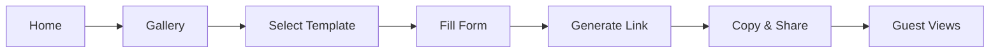
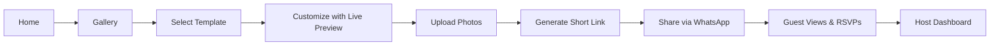
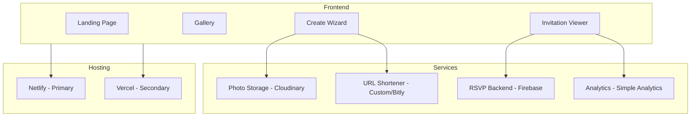

# InviteMagic Platform - CRESH Analysis

> **CRESH Framework**: Current State → Requirements → Expected State → Solutions → Handoff

---

## 📊 C - Current State Analysis

### What Exists Today

| Component | Status | Details |
|-----------|--------|---------|
| **Landing Page** | ✅ Complete | Professional hero, template grid, how-it-works |
| **Template Gallery** | ✅ Complete | 32 templates, 9 categories, filtering |
| **Customization Wizard** | ⚠️ Partial | Form works, but no live preview sync |
| **Invitation Viewer** | ⚠️ Partial | Shows data, but generic theme only |
| **Photo Gallery** | ❌ Missing | Placeholders only, no user upload |
| **RSVP System** | ❌ Missing | Form UI exists, no backend |
| **User Accounts** | ❌ Missing | No login, no saved drafts |
| **Analytics** | ❌ Missing | No view tracking |

### Current User Journey



### Current Pain Points

| Pain Point | User Impact | Severity |
|------------|-------------|----------|
| Can't upload photos | Invitations look generic | 🔴 Critical |
| Long ugly URLs | Hard to share, looks unprofessional | 🔴 Critical |
| No RSVP collection | Host can't track responses | 🔴 Critical |
| Generic theme on viewer | Doesn't match selected template style | 🟠 High |
| No edit after creation | Must create new link for changes | 🟠 High |
| No preview sync | Users can't see changes real-time | 🟡 Medium |
| No analytics | No idea who viewed invitation | 🟡 Medium |

### Current Tech Stack

| Layer | Technology |
|-------|------------|
| Frontend | HTML, Tailwind CSS, JavaScript |
| Animations | GSAP, Canvas Confetti |
| Hosting | Netlify (primary), Vercel (secondary) |
| CDN | Tailwind CDN, Font Awesome CDN |
| Forms | Static HTML forms |
| Database | None |

---

## 📋 R - Requirements Analysis

### Functional Requirements (MoSCoW)

#### Must Have (P0)
| Requirement | Description |
|-------------|-------------|
| **FR-01** | Photo upload with 3-5 image slots |
| **FR-02** | Template-specific theming in viewer |
| **FR-03** | RSVP collection with basic storage |
| **FR-04** | Short URL generation for sharing |
| **FR-05** | Mobile-responsive across all pages |

#### Should Have (P1)
| Requirement | Description |
|-------------|-------------|
| **FR-06** | Live preview updates as user types |
| **FR-07** | Social media preview (OG tags) |
| **FR-08** | View count tracking |
| **FR-09** | WhatsApp share with preview |
| **FR-10** | Edit invitation after creation |

#### Could Have (P2)
| Requirement | Description |
|-------------|-------------|
| **FR-11** | User accounts with saved invitations |
| **FR-12** | Multiple event support (wedding functions) |
| **FR-13** | Guest messaging/wishes wall |
| **FR-14** | PDF/Image download option |
| **FR-15** | Custom domain support |

#### Won't Have (This Phase)
| Requirement | Rationale |
|-------------|-----------|
| AI-generated content | Complex, defer to v2 |
| Video backgrounds | Storage/bandwidth heavy |
| Payment integration | Monetization phase |
| Multi-language | Localization later |

### Non-Functional Requirements

| NFR | Requirement | Target |
|-----|-------------|--------|
| **Performance** | Page load time | < 3 seconds |
| **Availability** | Uptime | 99.5% |
| **Scalability** | Concurrent users | 1000+ |
| **Security** | Data protection | HTTPS, no PII storage |
| **Accessibility** | WCAG compliance | Level AA |
| **SEO** | Search visibility | Meta tags, sitemap |

### User Personas

#### Persona 1: Wedding Host (Primary)
- **Age**: 25-35
- **Tech Savvy**: Medium
- **Need**: Beautiful wedding invitation to share on WhatsApp
- **Pain**: Doesn't want to use PDF, wants interactive invite
- **Goal**: Quick creation, easy sharing, track RSVPs

#### Persona 2: Parent (Birthday/Baby Shower)
- **Age**: 30-45
- **Tech Savvy**: Low-Medium
- **Need**: Fun, colorful invitation for child's event
- **Pain**: Limited budget, wants free solution
- **Goal**: Add photos, share on family WhatsApp groups

#### Persona 3: Event Organizer (Corporate)
- **Age**: 25-40
- **Tech Savvy**: High
- **Need**: Professional-looking event invitation
- **Pain**: Brand consistency, bulk sharing
- **Goal**: Collect RSVPs, track attendance

---

## 🎯 E - Expected State (Vision)

### Future User Journey



### Feature Comparison: Current vs Expected

| Feature | Current | Expected |
|---------|---------|----------|
| Photos | Placeholders | User uploads (Cloudinary) |
| Preview | Static iframe | Real-time sync |
| URLs | Long parameters | Short links (invmg.in/abc123) |
| RSVP | No backend | Firebase/Google Sheets |
| Theming | Generic purple | Template-specific |
| Analytics | None | View count, unique visitors |
| Editing | None | Edit with same link |
| Sharing | Manual | WhatsApp API integration |

### Success Metrics (KPIs)

| Metric | Target | Measurement |
|--------|--------|-------------|
| **Invitations Created** | 1000/month | Analytics |
| **Completion Rate** | 60%+ | Started vs Published |
| **Share Rate** | 80%+ | Generated links shared |
| **RSVP Response Rate** | 40%+ | Responses vs Views |
| **Page Load Time** | < 2s | Lighthouse |
| **Mobile Traffic** | 70%+ | Analytics |

---

## 🛠️ S - Solutions & Strategy

### Solution Architecture



### Implementation Phases

#### Phase 1: Core Fixes (Week 1)
| Task | Priority | Effort |
|------|----------|--------|
| Template-specific theming in viewer | P0 | 4 hrs |
| Live preview sync | P0 | 4 hrs |
| Fix mobile responsiveness | P0 | 2 hrs |
| OG meta tags for sharing | P1 | 2 hrs |

#### Phase 2: Photo & Short URLs (Week 2)
| Task | Priority | Effort |
|------|----------|--------|
| Cloudinary integration | P0 | 6 hrs |
| Photo upload UI in wizard | P0 | 4 hrs |
| Short URL service (bit.ly API) | P0 | 4 hrs |
| Photo display in viewer | P0 | 2 hrs |

#### Phase 3: RSVP & Analytics (Week 3)
| Task | Priority | Effort |
|------|----------|--------|
| Firebase setup | P0 | 2 hrs |
| RSVP submission backend | P0 | 4 hrs |
| RSVP display for host | P1 | 4 hrs |
| View count tracking | P1 | 4 hrs |
| Simple dashboard | P1 | 6 hrs |

#### Phase 4: Polish & Launch (Week 4)
| Task | Priority | Effort |
|------|----------|--------|
| Edit invitation feature | P1 | 6 hrs |
| PWA/Offline support | P2 | 4 hrs |
| Error handling & validation | P0 | 4 hrs |
| Performance optimization | P1 | 4 hrs |
| User testing & fixes | P0 | 8 hrs |

### Tech Stack Additions

| Component | Current | Proposed | Rationale |
|-----------|---------|----------|-----------|
| Photo Storage | None | Cloudinary | Free tier, CDN, transforms |
| Short URLs | None | Bit.ly API or Custom | Clean sharing |
| RSVP Backend | None | Firebase Firestore | Free tier, real-time |
| Analytics | None | Simple Analytics | Privacy-focused |
| Auth (Future) | None | Firebase Auth | SSO, easy setup |

### Risk Assessment

| Risk | Probability | Impact | Mitigation |
|------|-------------|--------|------------|
| Cloudinary free tier limit | Medium | High | Monitor usage, upgrade plan |
| Firebase security rules | High | Medium | Proper rule configuration |
| URL shortener rate limits | Low | Medium | Cache, self-hosted option |
| Mobile performance | Medium | High | Lazy loading, optimization |
| Data loss (no accounts) | High | Medium | Local storage backup |

---

## 📦 H - Handoff & Implementation Guide

### Immediate Actions (Today)

```bash
# 1. Fix template theming - Add template param to view.html
# 2. Add OG meta tags for better sharing
# 3. Test on mobile devices
```

### Development Setup

```bash
# Clone and run locally
cd "Ganishka Invite"
npx http-server -p 8080

# Deploy to Netlify
npx netlify-cli deploy --prod

# Deploy to Vercel
npx vercel --prod
```

### File Structure After Implementation

```
/
├── home.html              # Landing page
├── gallery.html           # Template browser
├── create.html            # Customization wizard
├── view.html              # Dynamic invitation viewer
├── dashboard.html         # Host RSVP dashboard (NEW)
├── api/
│   ├── shorten.js         # URL shortener (NEW)
│   └── rsvp.js            # RSVP handler (NEW)
├── templates/
│   └── [32 templates]
├── js/
│   ├── cloudinary.js      # Photo upload (NEW)
│   ├── firebase.js        # RSVP backend (NEW)
│   └── analytics.js       # View tracking (NEW)
├── vercel.json
└── netlify.toml
```

### Integration Checklist

- [ ] Create Cloudinary account
- [ ] Get Cloudinary API keys
- [ ] Create Firebase project
- [ ] Configure Firestore rules
- [ ] Create Bit.ly account (optional)
- [ ] Set up Simple Analytics
- [ ] Configure environment variables

### Testing Checklist

- [ ] Create invitation on mobile
- [ ] Create invitation on desktop
- [ ] Upload 5 photos
- [ ] Generate short URL
- [ ] Share to WhatsApp
- [ ] Submit RSVP as guest
- [ ] View RSVPs as host
- [ ] Load time < 3 seconds
- [ ] Works offline (PWA)

### Launch Checklist

- [ ] All P0 features complete
- [ ] Mobile tested (iOS + Android)
- [ ] Performance audit passed
- [ ] Security review done
- [ ] Analytics configured
- [ ] Error monitoring setup
- [ ] Documentation updated
- [ ] Production deployment verified

---

## 📊 Summary

| Phase | Focus | Duration | Outcome |
|-------|-------|----------|---------|
| **Phase 1** | Core Fixes | Week 1 | Working preview, proper theming |
| **Phase 2** | Photos & URLs | Week 2 | User photos, short sharing links |
| **Phase 3** | RSVP & Analytics | Week 3 | Response collection, tracking |
| **Phase 4** | Polish & Launch | Week 4 | Production-ready platform |

### Total Estimated Effort: 68 hours (4 weeks @ 17 hrs/week)

---

> **Document Version**: 1.0  
> **Created**: January 5, 2026  
> **Author**: InviteMagic Team  
> **Status**: Ready for Review
