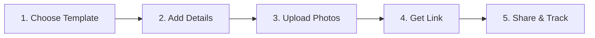

# InviteMagic - Project Vision & Context

---

## 💡 The Idea

### What is InviteMagic?

**InviteMagic** is a self-service platform that enables anyone to create beautiful, interactive digital invitations for any occasion — without design skills, coding knowledge, or expensive software.

> *"Transform your special moments into stunning digital experiences that guests will love."*

### The Vision

Replace traditional paper invitations and static PDFs with **immersive, mobile-first digital invitations** that:
- Engage guests with animations and interactivity
- Provide real-time RSVP tracking
- Are easy to share via WhatsApp and social media
- Work beautifully on any device

---

## 🎯 Problem Statement

### The Traditional Approach (Pain Points)

| Problem | Impact |
|---------|--------|
| **Paper invitations** | Expensive printing, postal delays, environmental waste |
| **PDF invitations** | Static, boring, hard to track RSVPs |
| **WhatsApp images** | Low quality, no interactivity, easily lost in chats |
| **Existing platforms** | Complex, expensive subscriptions, poor mobile experience |
| **DIY approach** | Requires design/coding skills, time-consuming |

### Who Faces This Problem?

1. **Young couples** planning weddings who want something modern
2. **Parents** organizing birthday parties for children
3. **Families** hosting traditional ceremonies (housewarming, engagement)
4. **Event organizers** needing quick, professional invites
5. **Corporate teams** sending event invitations

### The Gap in the Market

| Existing Solutions | Limitations |
|-------------------|-------------|
| Canva | Static designs, no interactivity |
| Paperless Post | Expensive, Western-focused |
| Evite | Outdated UI, not mobile-optimized |
| WhatsApp broadcasts | No tracking, no customization |
| Custom development | Expensive, time-consuming |

---

## 🌟 The Solution: InviteMagic

### Core Value Proposition

```
"Create stunning invitations in 2 minutes, share via WhatsApp, track RSVPs — all free."
```

### How It Works



### Key Differentiators

| Feature | InviteMagic | Others |
|---------|-------------|--------|
| **Interactive animations** | ✅ Reveal effects, confetti | ❌ Static |
| **Mobile-first design** | ✅ Built for phones | ⚠️ Adapted from desktop |
| **Indian cultural templates** | ✅ Wedding, housewarming, pujas | ❌ Western-focused |
| **WhatsApp optimized** | ✅ Preview, easy sharing | ⚠️ Basic |
| **Free tier** | ✅ Full features free | ❌ Paid plans required |
| **No account required** | ✅ Instant creation | ❌ Registration walls |

---

## 🎥 Demo Video Explanation

### Recording: Housewarming Template Demo


### What the Video Shows

| Timestamp | Action | Feature Demonstrated |
|-----------|--------|---------------------|
| 0:00-0:03 | Page loads | Template loads with reveal screen |
| 0:03-0:05 | "Tap to Open" visible | Interactive reveal mechanism |
| 0:05-0:08 | User taps screen | Smooth GSAP animation transition |
| 0:08-0:10 | Confetti burst | Canvas confetti celebration effect |
| 0:10-0:15 | Main content appears | Glassmorphism cards with event details |
| 0:15-0:20 | Scroll to gallery | Photo carousel placeholder visible |
| 0:20-0:25 | Countdown visible | Live countdown to event date |
| 0:25-0:30 | RSVP form shown | Guest response form |

### Key Features Visible in Demo

1. **Reveal Animation**
   - House icon with pulsing animation
   - Sanskrit text "गृह प्रवेश" (Griha Pravesh)
   - Smooth fade transition on tap

2. **Visual Design**
   - Earthy color palette (sage green, terracotta, gold)
   - Glassmorphism card effects
   - Traditional Indian ceremony icons (🪔🌺🥥🙏)

3. **Functional Components**
   - Music toggle button (top-right)
   - Photo gallery section
   - Countdown timer
   - Ceremony schedule
   - Venue with directions link
   - RSVP form

---

## 📸 Screenshots from Development

### Main Sections Captured


*Shows: Photo gallery, countdown timer (99 days to April 15, 2026), and ceremony schedule*


*Shows: RSVP form with name, phone, and attendance options*

---

## 🏗️ Current Implementation Status

### Platform Components

| Component | Status | URL |
|-----------|--------|-----|
| Landing Page | ✅ Live | `/home.html` |
| Template Gallery | ✅ Live | `/gallery.html` |
| Create Wizard | ✅ Live | `/create.html` |
| Invitation Viewer | ✅ Live | `/view.html` |

### Live Deployments

| Platform | URL |
|----------|-----|
| **Netlify** | https://invitemagic-templates.netlify.app |
| **Vercel** | https://invitemagic-eq5bi1jhh-invitation-spaces-projects.vercel.app |

### Template Library

| Category | Count | Examples |
|----------|-------|----------|
| Wedding | 8 | Royal, Minimalist, South Indian, Muslim, Christian |
| Birthday | 6 | Bash, Neon, Pastel, Kids, Milestone |
| Baby Shower | 4 | Boy, Girl, Godh Bharai |
| Corporate | 4 | Summit, Gala, Launch |
| Housewarming | 2 | Griha Pravesh, Modern Loft |
| Engagement | 2 | Ring Ceremony, Roka |
| Retirement | 2 | Corporate, Beach Escape |
| Graduation | 2 | Academic, Cap Toss |
| Anniversary | 2 | Love Story, Silver Jubilee |

**Total: 32 Templates across 9 Categories**

---

## 🎯 Target Audience

### Primary Users (India Focus)

1. **Newly Engaged Couples** (Age 22-32)
   - Planning multiple wedding functions
   - Want trendy, shareable invites
   - Heavy WhatsApp users

2. **New Parents** (Age 28-40)
   - First birthday, naming ceremonies
   - Family-oriented, value traditions
   - Budget-conscious

3. **Young Professionals** (Age 25-35)
   - Housewarming parties
   - Modern aesthetic preferences
   - Tech-savvy early adopters

### Secondary Users

- Corporate event managers
- School/college event organizers
- Community group leaders

---

## 💰 Future Monetization (Not Implemented Yet)

| Tier | Price | Features |
|------|-------|----------|
| **Free** | ₹0 | All templates, InviteMagic branding |
| **Premium** | ₹199/event | No branding, analytics, custom domain |
| **Business** | ₹999/month | Unlimited events, API access, white-label |

---

## 📅 Roadmap Summary

| Phase | Focus | Timeline |
|-------|-------|----------|
| **V1.0** (Current) | Core platform, templates | ✅ Complete |
| **V1.1** | Photo upload, short URLs | Week 1-2 |
| **V1.2** | RSVP backend, analytics | Week 3-4 |
| **V2.0** | User accounts, dashboard | Month 2 |
| **V3.0** | Premium features, monetization | Month 3+ |

---

> **Document Purpose**: This document provides context for stakeholders, investors, or team members to understand the InviteMagic vision, current state, and roadmap.

> **Last Updated**: January 5, 2026
